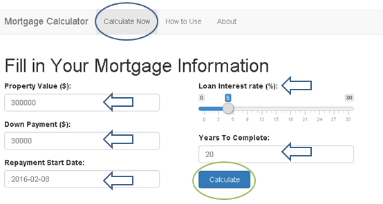
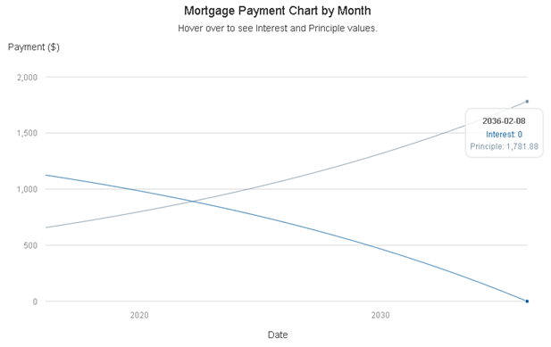

### Overview

Buying a house is one of the major decisions in life. If homework was not done diligently, one may risk falling into the nightmares of mortgage repayments. However with access to this Mortgage Calculator, one could easilly compute the mortgage commitments at breeze and make better mortgage decision.

** The calculation is based this [information](http://www.hughcalc.org/formula.php).

### Too Easy!

This Mortgage calculator requires minimal information to perform the computation.



--- .class #id 

### Too Friendly!  

In the `Calculation Results` section,
- `Summary` - Summary of the mortgage details.
- `Annual Amortization Table` - Displays the estimated interest, principle payment and remaining annual balance.
- `Monthly Amortization Table` - Displays the estimated interest, principle payment and remaining monthly balance.
- `Amortization Chart` A Mortgage Repayment Chart..



--- .class #id 

### Easy Calculations with R

The calculation of monthly payment is done using the R function below:

```{r}
calcMonthlyPayment <- function(principle, monthlyInterest, monthsToPay) {
  return(round(principle * (monthlyInterest/(1-(1+monthlyInterest)^(-monthsToPay))), digits = 2))
}
```

This is demonstrated below with property value $300000, down payment $30000, yearly loan interest rate 5% and total loan payment years equals to 10.

```{r}
# Example calculation of monthly payment
principle <- 300000 - 30000  #principle = propertyValue - downPayment
monthlyInterest <- 5/(12*100)   #monthlyInterest = yearlyInterest/(12*100) 
monthsToPay <- 10 * 12   #monthsToPay = yearsToPay * 12
calcMonthlyPayment(principle, monthlyInterest, monthsToPay)
```

--- .class #id 

### Calculations with R (continued...)

Procedure to create annual and monthly payment tables:

1. Current month interest payment (`cuMonthInterest`) equals to loan `balance` multiply by `monthlyInterest`.
2. Principle payment for the current month (`cuMonthPrinciple`) equals to monthly payment calculated above minus `cuMonthInterest`.
3. Next new loan `balance` is then equals to old `balance` minus `cuMonthPrinciple`.
4. Procedure is repeated from step one through step three with the new loan `balance` until loan `balance` is zero. 


### Quick instructions any time

You can refer to the `Documentation` tab on the navigation bar any time at the top of the shiny site which gives a simple description on how to use the Mortgage Calculator App. You can also check out the `About App` tab to view details about the application.


### Go to application link now

Mortgage Calculator Application link in Rstudio shiny server: https://yuriauyong.shinyapps.io/wk3Proj
