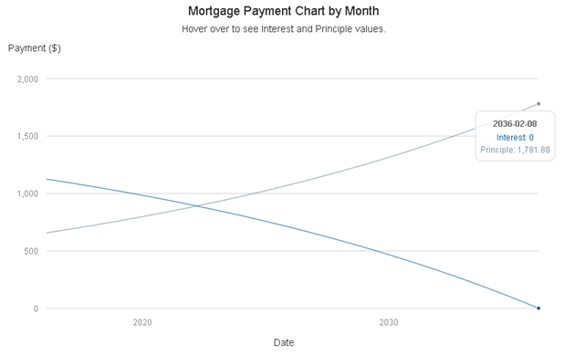

### Overview

Buying a house is one of the major decisions in life. If homework was not done diligently, one may risk falling into the nightmares of mortgage repayments. However with access to this Mortgage Calculator, one could easilly compute the mortgage commitments at breeze and make better mortgage decision.

** The calculation is based this [information](http://www.hughcalc.org/formula.php).

### Too Easy!

This Mortgage calculator requires minimal information to perform the computation.


--- .class #id 

### Too Friendly!  

In the `Calculation Results` section,
- `Summary` - Summary of the mortgage details.
- `Annual Amortization Table` - Displays the estimated interest, principle payment and remaining annual balance.
- `Monthly Amortization Table` - Displays the estimated interest, principle payment and remaining monthly balance.
- `Amortization Chart` A Mortgage Repayment Chart..



--- .class #id 

### Easy Calculations with R

A calculation demostration for monthly repayment with R Code:


```r
calcMonthlyPayment <- function(principle, monthlyInterest, monthsToPay) {
  round( principle * ( monthlyInterest / ( 1 - ( 1 + monthlyInterest ) ^ ( -monthsToPay ) ) ), digits = 2)
}
```

Say *property value* of $300000, *down payment* of $30000, *yearly loan interest rate* of 5% and *total loan payment years* of 10.


```r
principle = 300000 - 30000  # principle = propertyValue - downPayment
monthlyInterest = 5 / ( 12 * 100 )   # monthlyInterest = yearlyInterest / ( 12 * 100 ) 
monthsToPay = 10 * 12   # monthsToPay = yearsToPay * 12
```

The monthly repayment equates to,

```r
calcMonthlyPayment(principle, monthlyInterest, monthsToPay)
```

```
## [1] 2863.77
```

--- .class #id 

### Easy Facts

Procedure to create annual and monthly amortization tables:

1. Current month interest payment (`cuMonthInterest`) equals to loan `balance` multiply by `monthlyInterest`.
2. Principle payment for the current month (`cuMonthPrinciple`) equals to monthly payment calculated above minus `cuMonthInterest`.
3. Next new loan `balance` is then equals to old `balance` minus `cuMonthPrinciple`.
4. Procedure is repeated from step one through step three with the new loan `balance` until loan `balance` is zero. 

Refer to [github](https://github.com/yeongwei/coursera-develop-data-prods) for detailed information.


### Sticky Information

1. The `How to Use` tab consist of information about procedures to operate the application.
2. The `About` consist further information regards to the application.


### One Step Closer to Your Dream House!

Visit the website for this Mortgage Calculator anytime at [here](https://yeongwei.shinyapps.io/MortgageCalculator/).
